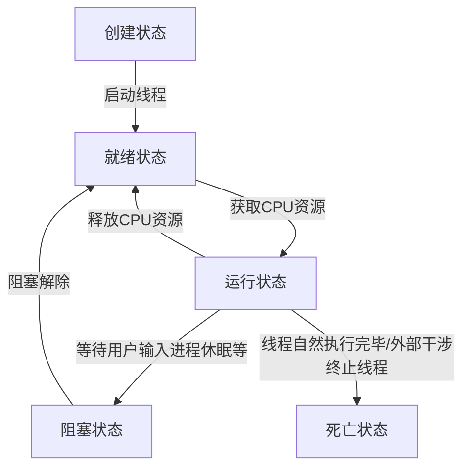

# Java多线程

## 线程创建

### 继承Thread类

重写run方法，调用start开启线程

```java
public class TestThread extends Thread {  
    @Override  
    public void run() {  
        // run方法线程体  
        for (int i = 0; i < 20; i++) {  
            System.out.println("run" + i);  
        }  
    }  
  
    public static void main(String[] args) {  
  
        // 创建线程对象  
        TestThread testThread = new TestThread();  
  
        // 调用start()方法开启线程  
        testThread.start();  
  
        // 主方法（主线程）  
        for (int i = 0; i < 20; i++) {  
            System.out.println("main" + i);  
        }  
    }  
}
```

### 实现Runnable接口

实现run方法，调用start开启线程

```java
public class TestThread implements Runnable {  
    @Override  
    public void run() {  
        // run方法线程体  
        for (int i = 0; i < 20; i++) {  
            System.out.println("run" + i);  
        }  
    }  
  
    public static void main(String[] args) {  
  
        // 创建runnable接口的实现类对象  
        TestThread testThread = new TestThread();  
  
        // 创建线程对象，通过线程对象开启线程  
        Thread thread = new Thread(testThread);  
  
        // 调用start()方法开启线程  
        thread.start();  
  
        // 主方法（主线程）  
        for (int i = 0; i < 20; i++) {  
            System.out.println("main" + i);  
        }  
    }  
}
```

### 实现Callable接口

1. 实现Callable接口，需要返回类型
2. 重写call方法，需要抛出异常
3. 创建目标对象
4. 创建执行服务`ExecutorService ser = Executors.newFixedThreadPool(1);`
5. 提交执行`Future<Boolean> result = ser.submit(1);`
6. 获取结果`boolean r = result.get();`
7. 关闭服务`ser.shutdownNow();`

```java
public class TestCallable implements Callable<Boolean> {  
    @Override  
    public Boolean call() {  
        // call方法线程体  
        for (int i = 0; i < 20; i++) {  
            System.out.println("call" + i);  
        }  
        return true;  
    }  
  
    public static void main(String[] args) throws ExecutionException, InterruptedException {  
        TestCallable testCallable = new TestCallable();  
        // 创建执行服务  
        ExecutorService ser = Executors.newFixedThreadPool(1);  
        // 提交执行  
        Future<Boolean> result = ser.submit(testCallable);  
  
        // 主方法（主线程）  
        for (int i = 0; i < 20; i++) {  
            System.out.println("main" + i);  
        }  
  
        // 获取进程运行结果  
        boolean r = result.get();  
        // 关闭服务  
        ser.shutdownNow();  
    }  
}
```

## 线程

- 每个线程在自己的工作内存交互，内存控制不当会造成数据不一致性。



|**方法**|**说明**|
|---|---|
|setPriotity(int newPriority)|更改线程的优先级|
|sleep(long millis)|在指定的毫秒数内让当前正在执行的线程休眠|
|join()|等待该线程终止|
|yield()|暂停当前正在执行的线程对象，并执行其他线程|
|interrrupt()|终端线程（不建议使用）|
|boolean isAlive()|测试线程是否处于活动状态|

### 停止线程

建议使用设置标志位的方法，不要使用stop或destroy等过时或JDK不建议使用的方法

```java
public class TestThreadStop implements Runnable{  
    private boolean flag = true;  
  
    @Override  
    public void run() {  
        int i = 0;  
        while (flag)  
        {  
            System.out.println("run Thread..." + i++);  
        }  
    }  
  
    public void stop()  
    {  
        this.flag = false;  
    }  
  
    public static void main(String[] args) {  
        TestThreadStop testThreadStop = new TestThreadStop();  
        new Thread(testThreadStop).start();  
  
        for (int i = 0; i < 1000; i++) {  
            System.out.println("main Thread..." + i);  
            if(i == 900)  
            {  
                testThreadStop.stop();  
                System.out.println("Thread Stop!!!");  
            }  
        }  
    }  
}
```

### 线程休眠

每个对象都有一个锁，sleep不会释放锁。

```java
public class TestThreadSleep{  
    // 模拟倒计时：10秒  
    public static void Count10() throws InterruptedException {  
        int num = 10;  
  
        while (true) {  
            Thread.sleep(1000);  
            System.out.println("num..." + num--);  
            if(num < 0) break;  
        }  
    }  
  
    public static void main(String[] args) {  
        try {  
            Count10();  
        } catch (InterruptedException e) {  
            e.printStackTrace();  
        }  
    }  
}
```

### 线程礼让

- 让当前正在执行的线程暂停，但不阻塞
- 将线程从运行状态转为就绪状态
- **让CPU重新调度，礼让不一定成功**

```java
public class TestThreadYield {  
    public static void main(String[] args) {  
        MyYield myYield = new MyYield();  
        new Thread(myYield, "A").start();  
        new Thread(myYield, "B").start();  
    }  
}  
  
class MyYield implements Runnable {  
    @Override  
    public void run() {  
        System.out.println(Thread.currentThread().getName() + " Thread Start");  
        Thread.yield();  
        System.out.println(Thread.currentThread().getName() + " Thread Stop");  
    }  
}
```

礼让成功示例输出：

```bash
B Thread Start
A Thread Start
B Thread Stop
A Thread Stop
```

礼让不成功示例输出：

```bash
B Thread Start
B Thread Stop
A Thread Start
A Thread Stop
```

### 线程强制执行

```java
public class TestThreadJoin implements Runnable {  
    @Override  
    public void run() {  
        for (int i = 0; i < 100; i++) {  
            System.out.println("Thread Vip " + i++);  
        }  
    }  
  
    public static void main(String[] args) throws InterruptedException {  
        TestThreadJoin testThreadJoin = new TestThreadJoin();  
        Thread thread = new Thread(testThreadJoin);  
        thread.start();  
  
        for (int i = 0; i < 200; i++) {  
            if(i == 100) {  
                // join  
                thread.join();  
                // 直到子线程执行完，才继续执行主线程  
            }  
            System.out.println("main Thread " + i++);  
        }  
    }  
}
```

### 线程状态

线程一旦进入死亡或终止状态，就无法再启动。

```java
public class TestThreadState {  
    public static void main(String[] args) throws InterruptedException {  
        Thread thread = new Thread(() -> {  
            for(int i = 0; i < 5; i++) {  
                try {  
                    Thread.sleep(1000);  
                } catch (InterruptedException e) {  
                    e.printStackTrace();  
                }  
            }  
            System.out.println("//////");  
        });  
  
        Thread.State state = thread.getState();  
        System.out.println(state); // NEW  
  
        thread.start();  
        state = thread.getState();  
        System.out.println(state); // RUN  
  
        while (state != Thread.State.TERMINATED) { // 线程不终止  
            Thread.sleep(100);  
            state = thread.getState();  
            System.out.println(state);  
        }  
  
  
    }  
}
```

输出结果：

```bash
NEW
RUNNABLE
TIMED_WAITING
...
TIMED_WAITING
RUNNABLE
//////
TERMINATED
```

### 线程优先级

- `getPriority()` 获取线程优先级
- `setPriority(int)` 设置线程优先级(要先设置优先级再启动线程)

### 守护线程

- 虚拟机必须确保用户线程执行完毕，不需要等待守护线程执行完毕
- `setDaemon(boolean)`参数为true，将线程设置为守护线程

## 线程同步

并发：同一个对象被多个线程同时操作

- 为了保证数据在方法中被访问时的正确性，在访问时加入==锁机制==(synchronized)，当一个线程获得对象的排他锁，独占资源，其他线程必须等待，使用后释放锁即可。存在以下问题：
	- 一个线程持有锁会导致其他所有需要此锁的线程挂起；
	- 在多线程竞争下，加锁，释放锁会导致比较多的上下文切换和调度延迟，引起性能问题；
	- 如果一个优先级高的线程等待一个优先级低的线程释放锁会导致优先级倒置，引起性能问题。

### 线程不安全案例

>买票问题：多个人买到同一张票或第-1张票

```java
public class UnsafeBuyTicket {  
    public static void main(String[] args) {  
        BuyTicket buyTicket = new BuyTicket();  
  
        new Thread(buyTicket, "A").start();  
        new Thread(buyTicket, "B").start();  
        new Thread(buyTicket, "C").start();  
    }  
}  
  
class BuyTicket implements Runnable {  
    private int tick_numbers = 10;  
    boolean flag = true;  
  
    @Override  
    public void run() {  
        // Buy Ticket  
        while(flag) {  
            try {  
                buy();  
            } catch (InterruptedException e) {  
                e.printStackTrace();  
            }  
        }  
    }  
  
    public void buy() throws InterruptedException {  
        if(tick_numbers <= 0) {  
            flag = false;  
            return;  
        }  
        Thread.sleep(100);  
        // Buy  
        System.out.println(Thread.currentThread().getName()+  
                " buy the ticket " + tick_numbers--);  
    }  
}

/*** Output ***/
/*
B buy the ticket 10
C buy the ticket 9
A buy the ticket 10
A buy the ticket 7
B buy the ticket 6
C buy the ticket 8
B buy the ticket 4
A buy the ticket 5
C buy the ticket 3
A buy the ticket 1
C buy the ticket 2
B buy the ticket 0
*/
```

> 取钱问题：同一时间多人取钱，导致余额变为负数

```java
public class UnsafeBank {  
    public static void main(String[] args) {  
        Account account = new Account(100, "Base Money");  
        Drawing drawing_boy = new Drawing(account, 100, "Boy");  
        Drawing drawing_girl = new Drawing(account, 50, "Girl");  
  
        drawing_boy.start();  
        drawing_girl.start();  
    }  
}  
  
  
class Account {  
    int money;  
    String name;  
  
    public Account(int money, String name) {  
        this.money = money;  
        this.name = name;  
    }  
}  
  
class Drawing extends Thread {  
    Account account;  
    int drawing_money;  
    int current_money;  
  
    public Drawing(Account account, int drawing_money, String name) {  
        super(name);  
        this.account = account;  
        this.drawing_money = drawing_money;  
    }  
  
    @Override  
    public void run() {  
        if(account.money - drawing_money < 0) {  
            System.out.println(this.getName() + " money is not enough");  
            return;  
        }  
        account.money -= drawing_money;  
        current_money += drawing_money;  
        System.out.println(this.getName() + " has money " + current_money);  
        System.out.println(account.name + " has " + account.money + " left.");  
    }  
}

/*** Output ***/
/*
Girl has money 50
Base Money has -50 left.
Boy has money 100
Base Money has -50 left.
*/
```

> ArrayList：多个线程操作同一ArrayList对象时不安全，例如执行了20次add()，而最终ArrayList只有不到20个元素。

```java
public class UnsafeList {  
    public static void main(String[] args) {  
        List<String> list = new ArrayList<String>();  
        for(int i = 0; i < 10000; i++) {  
            new Thread(() -> {  
                list.add(Thread.currentThread().getName());  
            }).start();
        }  
  
        try {  
            Thread.sleep(3000);  
        } catch (InterruptedException e) {  
            e.printStackTrace();  
        }  
  
        System.out.println(list.size());  
    }  
}

/*** Output ***/
/*
9999
*/
```

### 同步方法

- 由于我们可以通过`private`关键字来保证数据对象只能被方法访问，所以我们只需要针对方法提出一套机制，这套机制就是`synchronized`关键字，它包括两种用法：`synchronized`方法和`synchronized`块。
	- 同步方法：`public synchronized void method(int args)`
- `synchronized`方法控制对“对象”的访问，每个对象对应一把锁，每个`synchronized`方法都必须获得调用该方法的对象的锁才能执行，否则线程会阻塞，方法一旦执行，就独占该锁，直到该方法返回才释放锁，后面被阻塞的线程才能获得这个锁，继续执行。
	- 缺陷：若将一个大的方法声明为`synchronized`将会影响效率
- `synchronized`默认锁的是`this`
- `synchronized`锁的对象一般为需要增、删、改的对象

> 三大问题解决方法

- 买票问题：将`buy`方法定义改为有`synchronized`修饰，`public synchronized void buy() throws InterruptedException {}`
- 取钱问题：将`run()`方法改为
```java
@Override  
public void run() {  
    synchronized(account) {
	    //TODO(Previous Code)
    }
```
- ArrayList：原先lambda表达式改为：
```java
new Thread(() -> {  
	synchronized(list) {
		list.add(Thread.currentThread().getName());  
	}
}).start();
```

### 死锁

两个线程或多个线程都在等待对方释放资源，都停止执行的情形。同一个同步代码块同时拥有“两个以上对象的锁”时，就可能会发生“死锁”的问题。

**产生死锁的四个必要条件**：
- 互斥条件:一个资源每次只能被一个进程使用。
- 请求与保持条件:一个进程因请求资源而阻塞时，对已获得的资源保持不放。
- 不剥夺条件:进程已获得的资源，在末使用完之前，不能强行剥夺。
- 循环等待条件:若干进程之间形成一种头尾相接的循环等待资源关系。


### Lock(锁)

从JDK5.0开始，Java提供了更强大的线程同步机制——通过显示定义同步锁对象来实现同步。同步锁使用Lock对象充当。

示例代码如下

```java
class A {
	private final ReentrantLock lock = new ReentrantLock();
	public void m() {
		lock.lock();
		try {
			// TODO
		} finally {
			lock.unlock();
		}
	}
}
```

## 线程协作

**生产者消费者问题**：
- 假设仓库中只能存放一件物品，生产者将生产出来的产品放入仓库，消费者将仓库中产品取走消费。
- 如果仓库中没有产品，则生产者将产品放入仓库，否则停止生产并等待，直到仓库中的产品被消费者取走为止。
- 如果仓库中放有产品，则消费者可以将产品取走消费，否则停止消费并等待直到仓库中再次放入产品为止。

> 解决方法1：利用缓冲区解决（管程法）

```java
public class TestPC {  
    public static void main(String[] args) {  
        SynContainer container = new SynContainer();  
        new Producer(container).start();  
        new Consumer(container).start();  
    }  
}  

// 生产者
class Producer extends Thread {  
    SynContainer container;  
  
    public Producer(SynContainer container) {  
        this.container = container;  
    }  
  
    @Override  
    public void run() {  
        for (int i = 0; i < 100; i++) {  
            container.push(new Product(i));  
            System.out.println("Producer produce the product " + i);  
        }  
    }  
}  

// 消费者
class Consumer extends Thread {  
    SynContainer container;  
  
    public Consumer(SynContainer container) {  
        this.container = container;  
    }  
  
    @Override  
    public void run() {  
        for (int i = 0; i < 100; i++) {  
            System.out.println("Consumer consume the product " + container.pop().id);  
        }  
    }  
}  
  
class Product {  
    int id;  
    public Product(int id) {  
        this.id = id;  
    }  
}  

// 容器
class SynContainer {  
    Product[] products = new Product[10];  
    int cnt = 0;  
  
    // Producer  
    public synchronized void push(Product product) {  
        if(cnt == products.length) {  
            // wait for consumer  
            try {  
                this.wait();  
            } catch (InterruptedException e) {  
                throw new RuntimeException(e);  
            }  
        }  
        products[cnt] = product;  
        cnt ++;  
  
        this.notifyAll();  
    }  
    // Consumer  
    public synchronized Product pop() {  
        if(cnt == 0) {  
            // wait for producer  
            try {  
                this.wait();  
            } catch (InterruptedException e) {  
                throw new RuntimeException(e);  
            }  
        }  
  
        cnt--;  
        this.notifyAll();  
        return products[cnt];  
    }  
}
```

> 解决方法2：利用标志位解决（信号灯法）

```java
public class TestPC {  
    public static void main(String[] args) {  
        Product product = new Product();  
        new Producer(product).start();  
        new Consumer(product).start();  
    }  
}  
  
class Producer extends Thread {  
    Product product;  
    public Producer(Product product) {  
        this.product = product;  
    }  
  
    @Override  
    public void run() {  
        for (int i = 0; i < 20; i++) {  
            this.product.Produce(i);  
        }  
    }  
}  
  
class Consumer extends Thread {  
    Product product;  
    public Consumer(Product product) {  
        this.product = product;  
    }  
  
    @Override  
    public void run() {  
        for (int i = 0; i < 20; i++) {  
            this.product.Consume();  
        }  
    }  
}  
  
class Product {  
    int id;  
    boolean produced = false;  
  
    public synchronized void Produce(int id) {  
        if(this.produced) {  
            try {  
                this.wait();  
            } catch (InterruptedException e) {  
                throw new RuntimeException(e);  
            }  
        }  
        System.out.println("Producer produce the product " + id);  
        this.id = id;  
        this.produced = !produced;  
        this.notifyAll();  
    }  
  
    public synchronized void Consume() {  
        if(!this.produced) {  
            try {  
                this.wait();  
            } catch (InterruptedException e) {  
                throw new RuntimeException(e);  
            }  
        }  
        System.out.println("Consumer consume the product " + id);  
        this.produced = !produced;  
        this.notifyAll();  
    }  
}
```

### 线程池

- 提高响应速度
- 降低资源消耗
- 便于线程管理

```java
// 创建服务，创建线程池
public class TestThreadPool {  
    public static void main(String[] args) {  
        // 创建服务，创建线程池  
        ExecutorService service = Executors.newFixedThreadPool(10);  
        // 添加线程到线程池  
        service.execute(new MyThread());  
        service.execute(new MyThread());  
        service.execute(new MyThread());  
        // 关闭链接  
        service.shutdownNow();  
    }  
}  
  
class MyThread implements Runnable {  
    @Override  
    public void run() {  
        System.out.println(Thread.currentThread().getName());  
    }  
}
```