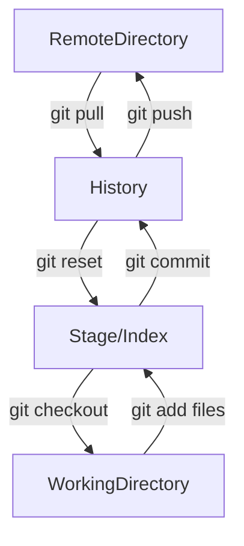

# Git

## git配置

- 查看配置 ```git config -l```

- 查看系统配置 ```git config --system --list```
    系统配置的目录: ```git/etc/gitconfig```

- 用户配置 ==(首次必须配置)== ```git config --global --list```
    用户配置的目录: ```Users/<用户名>/.gitconfig```
    - 设置用户名 ```git config --global user.name ""```
    - 设置邮箱 ```git config --global user.email ""```

## git基本理论
Git本地有三个工作区域: 工作目录(Working Directory)、暂存区(Stage/Index)、资源库(Repository/Git Directory)、如果加上远程的git仓库(Remote Directory)就包括了四个工作区域。文件在四个区域的转化关系如下:



- Workspace: 工作区，存放代码的地方
- Index/Stage: 暂存区，用于临时存放改动，本质是一个文件，保存即将提交到文件列表信息
- Respository: 仓库区（或本地仓库），就是安全存放数据的位置，这里有提交到所有版本的数据。其中HEAD指向最新放入仓库的版本
- Remote: 远程仓库，托管代码的服务器

> 工作流程

1. 在工作目录中添加、修改文件；
2. 将需要进行版本管理的文件放入暂存区；
3. 将暂存区的文件提交到git仓库。
因此，git管理的文件有三种状态：已修改(modified)、已暂存(staged)、已提交(commited)

## Git项目搭建

> 本地仓库搭建

```bash
$ git init
```

> 克隆远程仓库

```bash
$ git clone [url]
```

## Git文件操作

> 文件的4种状态

- Untracked: 未跟踪，此文件在文件夹中，但并没有加入到git库，不参与版本控制。通过```git add```状态变为 ```Staged```

- Unmodify: 文件已经入库，未修改，即版本库中的文件快照内容与文件夹中完全一致。这种类型的文件有两种去处，如果它被修改，而变为```Modified```。如果使用```git rm```移出版本库，则成为```Untracked```文件

- Modified: 文件已修改，仅仅是修改，并没有进行其他的操作。这个文件也有两个去处，通过```git add```可进入暂存```Staged```状态，使用```git checkout```则丢弃修改过，返回到```Unmodify```状态，这个 ```git checkout```即从库中取出文件，覆盖当前修改

- Staged: 暂存状态。执行```git commit```则将修改同步到库中，这时库中的文件和本地文件又变为一致，文件为```Unmodify```状态。执行git reset HEAD filename取消暂存，文件状态为```Modified```

> 查看文件状态

```bash
# 查看文件状态
$ git status [file]

# 查看所有文件状态
$ git status
```

> 操作文件

```bash
# 添加所有文件到暂存区
$ git add .

# 提交暂存区中的内容到本地仓库
$ git commit -m ""
```

> 忽略文件

添加```.gitignore```文件

1. 忽略文件中的空行或以井号(# ）开始的行将会被忽略。
2. 可以使用Linux通配符。例如:星号(*)代表任意多个字符，问号(?)代表一个字符，方括号([abc])代表可选字符范围，大括号({string1,string2,.…})代表可选的字符串等。
3. 如果名称的最前面有一个感叹号(!)，表示例外规则，将不被忽略。
4. 如果名称的最前面是一个路径分隔符(/)，表示要忽略的文件在此目录下，而子目录中的文件不忽略。
5. 如果名称的最后面是一个路径分隔符(/)，表示要忽略的是此目录下该名称的子目录，而非文件(默认文件或目录都忽略）。

```bash
*.txt       # 忽略所有.txt结尾的文件
!lib.txt    # 但lib.txt除外
/temp       # 仅忽略项目根目录下的TODO文件，不包括其他目录/temp
build/      # 仅忽略build/目录项的所有文件
doc/.txt    # 会忽略doc/notes.txt 但不包括doc/server/arch.txt
```

## Git分支

> git分支常用命令

```bash
# 查看所有分支
$ git branch

# 列出所有远程分支
$ git branch -r

# 新建一个分支，但仍然留在当前分支
$ git branch [branch-name]

# 新建一个分支，并跳转到该分支
$ git checkout -b [branch-name]

# 合并指定分支到当前分支
$ git merge [branch-name]

# 删除分支
$ git branch -d [branch-name]

# 删除远程分支
$ git push origin --delete [branch-name]
$ git branch -dr [remote/branch-name]
```

## GitHub

> 设置本机SSH公钥，实现免密登录

```bash
$ cd ~/.ssh/
# 生成公钥
$ ssh-keygen
$ ssh-keygen -t rsa # 后面的部分为加密算法
```